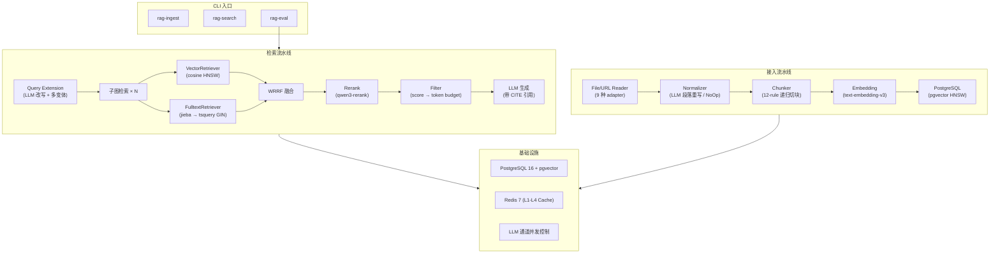

# rag-pipeline

[](https://github.com/nathanprogsun/rag-pipeline/actions/workflows/ci.yml)
[](https://www.python.org/)
[]()

> 面向中文量化策略文档的 RAG 引擎——混合检索、评估门禁、异步全链路。

---

## 为什么做这个项目

代码文件（策略、回测脚本、研究笔记）含有大量中文术语和自然语言描述，但传统的向量检索把代码变量名和中文语义混在一起 embedding，导致：

```
搜索 "ETF轮动"      → ❌ 搜不到结果
搜索 "小市值策略"   → ❌ 搜不到结果
```

原因：代码中 `def calculate_bollinger_signal(close, window=20):` 的 embedding 和 "布林带策略" 的语义空间不在一个维度上。

**这个项目的核心命题**：如何让代码文档像自然语言文档一样可检索，同时保持代码的原始结构供 LLM 阅读理解。

---

## 快速体验

```bash
# 1. 启动基础设施
make up

# 2. 接入策略代码文件
uv run rag-ingest 策略/简单市值轮动策略.txt \
  --create-dataset --dataset-name "quant-strategies"

# 3. 搜索
uv run rag-search -q "小市值轮动调仓逻辑" --dataset-id <UUID>
```

**输出示例：**

```
Query: 小市值轮动调仓逻辑

Response:
策略使用市值因子轮动，调仓周期为 10 个交易日。
调仓条件为 `g.days % g.period != 1`，即每 10 天执行一次。
选股逻辑为全市场 A 股（沪深）中按市值升序排列，
取 `g.stocksnum`（10 只）最小市值股票等权买入。
在调仓日卖出不在 buylist 中的持仓，买入新入选股票。

Citations (3):
  [1] 简单市值轮动策略-学习.txt (score=0.872)
  [2] 简单市值轮动策略-学习.txt (score=0.731)
  [3] 简单市值轮动策略-学习.txt (score=0.654)
```

LLM 不仅找到了策略，还能从代码中准确提取调仓条件和选股逻辑，并标注引用来源。

---

## 核心能力

| 能力 | 说明 |
|------|------|
| **混合检索** | pgvector 向量检索 (cosine) + PostgreSQL 全文检索 (GIN tsvector) 双路召回，WRRF 融合 + rerank 重排 |
| **9 种文件格式** | txt / md / html / pdf / docx / pptx / csv / xlsx / URL |
| **中文适配** | jieba 分词 + 中文标点感知的 chunk 策略 + 中文 LLM（DashScope / MiniMax） |
| **评估门禁** | RAGAS 指标打分，recall@k / precision@k / MRR / NDCG，低于阈值自动阻断 |
| **生产级工程** | async 全链路、指数退避重试、4 级 Redis 缓存、NDJSON 审计日志 |
| **质量保障** | 92% 测试覆盖、mypy strict、ruff 全量检查、pre-commit |

---

## 架构



---

## 亮点设计

### 双路混合检索

```python
# 每路权重可调
vector_weight=0.7    # 向量检索语义匹配
fulltext_weight=0.3  # 全文检索精确命中（函数名、变量名）

# WRRF (Weighted Reciprocal Rank Fusion) 融合双路结果
score = sum(weight / (k + rank))
```

向量擅长语义相似，全文擅长精确匹配——双路互补，针对代码文档的混合场景特别有效。

### 多级缓存

| 层级 | 缓存内容 | TTL |
|------|----------|-----|
| L1 | embedding(text → vector) | 24h |
| L2 | query extension(LLM 改写) | 30min |
| L3 | search 检索结果 | 5min |
| L4 | rerank 结果 | 1h |

DB chunk 变更时主动失效关联缓存，Redis 不可用自动降级。

### 评估 + 质量门禁

```
eval.jsonl (每行一条):
  {"query":"小市值策略","dataset_ids":[...],"ground_truth_chunk_ids":[...],"k":10}

输出指标:
  recall@k  precision@k  hit_rate@k  mrr  ndcg@k
  均值 / 标准差 / 最小值 / 最大值 / 中位数 / 计数

质量门禁: 某指标低于阈值 → 阻断部署
```

---

## 快速开始

```bash
# 1. 安装
git clone https://github.com/nathanprogsun/rag-pipeline
cd rag-pipeline
uv sync --extra dev

# 2. 配置
cp .env.example .env
# 填入 OPENAI_API_KEY / OPENAI_BASE_URL / OPENAI_MODEL
# 可选: OPENAI_EMBEDDING_*, OPENAI_RERANK_*, DATABASE_URL, REDIS_URL

# 3. 启动 PG + Redis
make up

# 4. 接入文档
uv run rag-ingest tests/data/sample.txt --create-dataset --dataset-name "demo"

# 5. 搜索
DS=$(uv run rag-search list-datasets list --output json | jq -r '.datasets[0].id')
uv run rag-search -q "Python 列表推导式" --dataset-id "$DS"
```

---

## 工程规范

| 规范 | 标准 |
|------|------|
| 类型系统 | mypy strict（`disallow_untyped_defs=true`） |
| 代码检查 | ruff（ANN/B/E/F/I/UP/PGH 全开） |
| 测试 | pytest + pytest-asyncio，107 个测试文件，781 个用例 |
| 覆盖率 | 92%（门禁 80%） |
| CI | GitHub Actions：lint → mypy → unit → integration → coverage |

---

<details>
<summary><b>CLI 命令参考</b>（点击展开）</summary>

### `rag-ingest` — 文档接入

```bash
rag-ingest [OPTIONS] PATH [PATH ...]
```

| 选项 | 说明 |
|------|------|
| `PATH` | 文件/目录路径，或 `--mode url` 时为单个 URL |
| `--mode {file,url}` | 解析模式，默认 file |
| `-r, --recursive` | 递归展开目录 |
| `--normalize {auto,off,force}` | LLM 段落重整，默认 off |
| `--dataset-id UUID` | 落库目标 dataset |
| `--create-dataset` | 新建 dataset |
| `--chunk-stats` | 输出切块质量统计 |

### `rag-search` — 检索 + 生成

```bash
rag-search -q "query" --dataset-id <UUID>
```

| 选项 | 说明 |
|------|------|
| `-q, --query` | 搜索 query |
| `--dataset-id` | 目标 dataset UUID（可多次指定） |
| `-k, --top-k` | 召回 top-k，默认 10 |
| `--output {text,json}` | 输出格式 |
| `--rerank-weight` | rerank 权重 [0,1]，默认 0.7 |

子命令 `rag-search list-datasets list` 列出可用 datasets。

### `rag-eval` — 评估

```bash
rag-eval -d data/eval.jsonl
```

| 选项 | 说明 |
|------|------|
| `-d, --dataset` | Eval JSONL 路径 |
| `-k, --k` | 默认 top-k |
| `--concurrency` | 并发数，默认 4 |
| `--output {text,json}` | 输出格式 |

</details>

<details>
<summary><b>目录结构</b>（点击展开）</summary>

```
src/rag/
  config.py            # pydantic-settings 配置
  exception.py         # 全局单一异常 RAGError
  domain/              # Pydantic DTO（无 I/O 依赖）
  infra/
    pg/                # SQLAlchemy 2.0 异步基础 + pgvector + 全文索引
    cache/             # 4 级 Redis 缓存 + 失效策略
    llm/               # chat / embed / rerank 客户端 + 并发控制
    observability/     # NDJSON 审计 + 追踪
    text/              # 引用解析工具
  ingest/              # 接入流水线：Reader → Normalizer → Chunker
  search/              # 检索流水线：QueryExt → Subgraph → Fusion → Rerank → Filter → Cite → Gen
  eval/                # 评估流水线：指标计算 + 质量门禁
tests/
  unit/                # 纯逻辑测试
  integration/         # 真实 PG/Redis 集成测试
  data/                # 9 种格式测试 fixture
docs/                  # 架构文档
.github/workflows/     # CI（ruff + mypy + pytest + codecov）
```

</details>

<details>
<summary><b>配置参数</b>（点击展开）</summary>

### ChunkSettings

| 字段 | 默认 | 含义 |
|------|------|------|
| chunk_size | 1000 | 目标 chunk 大小（字符） |
| max_chunk_size | 8000 | 硬上限 |
| overlap_ratio | 0.10 | 重叠比例 |
| min_chunk_size | 256 | 短 chunk 合并阈值 |

### 检索参数

| 字段 | 默认 | 含义 |
|------|------|------|
| vector_weight | 0.7 | 向量检索权重 |
| fulltext_weight | 0.3 | 全文检索权重 |
| rerank_weight | 0.7 | rerank 融合权重 |
| rrf_k | 60 | RRF 常量 |
| top_k | 10 | 每 dataset 召回数 |
| token_budget | 960000 | 最终 token 上限 |

### 缓存（4 级）

| 层级 | 内容 | TTL |
|------|------|-----|
| L1 | embedding | 24h |
| L2 | query extension | 30min |
| L3 | search 结果 | 5min |
| L4 | rerank 结果 | 1h |

</details>

<details>
<summary><b>开发指南</b>（点击展开）</summary>

```bash
make lint              # ruff check + format --check + mypy
make test              # unit + integration
make test-unit         # 仅单元测试

uv run pytest tests/unit/ -v
uv run ruff check --fix . && uv run ruff format .
uv run pre-commit run --all-files
```

提交格式：`<type>: <description>`（feat / fix / refactor / docs / test / chore / perf / ci）

</details>

---

## 技术栈

| 类别 | 技术 |
|------|------|
| 语言/运行时 | Python 3.13, uv |
| 向量数据库 | PostgreSQL 16 + pgvector (HNSW) |
| 全文检索 | PostgreSQL GIN tsvector + jieba 分词 |
| 缓存 | Redis 7 (4 级, TTL + 主动失效) |
| Embedding | text-embedding-v3 (DashScope, 1536 维) |
| Rerank | qwen3-rerank |
| LLM | MiniMax-M3 (OpenAI 兼容) |
| ORM | SQLAlchemy 2.0 async |
| 验证 | Pydantic v2 |
| 工程 | ruff, mypy strict, pre-commit |
| CI | GitHub Actions (lint + type check + test + coverage) |
| 部署 | Docker Compose (pgvector + Redis + CLI) |
